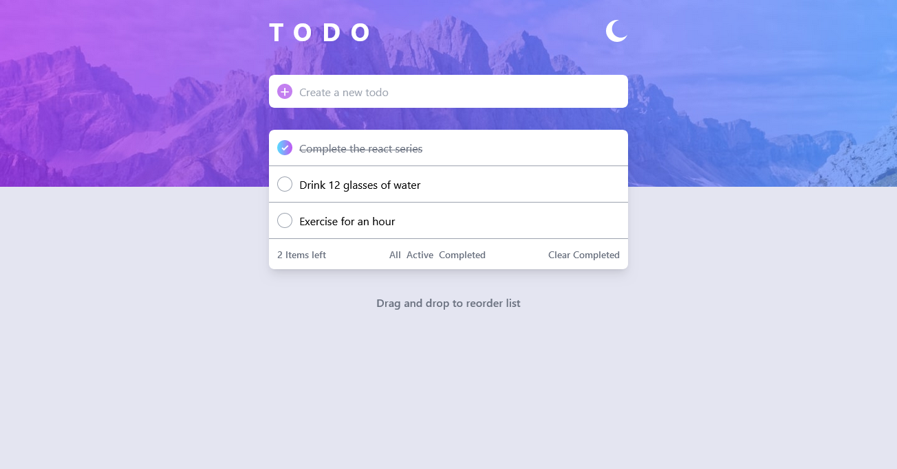

# Frontend Mentor - Todo app solution

This is a solution to the [Todo app challenge on Frontend Mentor](https://www.frontendmentor.io/challenges/todo-app-Su1_KokOW). Frontend Mentor challenges help you improve your coding skills by building realistic projects. 

## Table of contents

- [Overview](#overview)
  - [The challenge](#the-challenge)
  - [Screenshot](#screenshot)
  - [Links](#links)
- [My process](#my-process)
  - [Built with](#built-with)
  - [What I learned](#what-i-learned)
  - [Continued development](#continued-development)
  - [Useful resources](#useful-resources)
- [Author](#author)
- [Acknowledgments](#acknowledgments)


## Overview
This project implements a simple todo list application with features including task management, drag-and-drop functionality, and light/dark mode toggling.

Features:

Task Management:

Add new tasks with a specified status (active by default).
Mark tasks as completed by clicking on them or using a checkbox.
Remove tasks individually using a cross button.

Task Filtering:

Filter tasks by status (All, Active, Completed) using dedicated buttons.
Clear all completed tasks with a single button click.

Drag-and-Drop:

Reorder tasks by dragging them up or down within the list.

Mode Toggle:

Switch between light and dark modes for different visual preferences.
### The challenge

Users should be able to:

- View the optimal layout for the app depending on their device's screen size
- See hover states for all interactive elements on the page
- Add new todos to the list
- Mark todos as complete
- Delete todos from the list
- Filter by all/active/complete todos
- Clear all completed todos
- Toggle light and dark mode
- **Bonus**: Drag and drop to reorder items on the list

### Screenshot



### Links

- Solution URL: [Add solution URL here](https://github.com/ShivWK/Todo-list-Fronend-Mentor.git)
- Live Site URL: [Add live site URL here](https://todo-list-fronend-mentor.vercel.app/)

## My process

### Built with

- Semantic HTML5 markup
- Tailwind CSS
- Flexbox
- Mobile-first workflow
- Vanilla JavaScript


### What I learned

- Implemented drag-and-drop functionality for task reordering within the DOM and synchronizing changes in an array.

- Dynamically created tasks in the DOM and attached event listeners for interactive functionality.

- Utilized Tailwind CSS extensively for styling, marking the first major project where I applied this framework.

```html
<li data-status="active" class="tasks overflow-hidden relative group w-full items-center justify-between flex bg-white gap-2 py-1.5 px-4 border-b-[0.3px] border-gray-400">
    <div class="innertask w-fit flex gap-2 items-center">
        <button class="w-[22px] absolute checkBtn h-[22px]  rounded-full border-[0.3px] border-gray-400 flex justify-center items-center "></button>
        <span class="w-full ml-8 taskSpan break-words select-none py-2 border-2 cursor-pointer border-black outline-none border-none">Complete DSA bsics playlist</span>
    </div>
    <button class="crossBtn md:hidden absolute right-3 md:group-hover:block"></button>  
</li> 
```

```js
const task = document.createElement('li');
            task.setAttribute('data-status', 'active');
            task.setAttribute('draggable', 'true');
            task.className = `tasks overflow-hidden relative group w-full items-center justify-between flex ${modeOfList} gap-2 py-1.5 px-3 border-b-[0.3px] border-gray-400`;
            
            task.innerHTML = `<div class="innertask w-fit flex gap-2 items-center">
                                <button class="w-[22px] absolute checkBtn h-[22px]  rounded-full border-[0.3px] border-gray-400 flex justify-center items-center "></button>
                            <span class="w-full flex text-wrap break-all items-center ml-8 mr-4 taskSpan select-none py-2 cursor-pointer border-black outline-none ${modeOfTExt} border-none">${inputAdder.value}</span>
                            </div>
                            <button class="crossBtn md:hidden absolute pl-2  right-2 md:group-hover:block"></button>`;
            inputAdder.value='';
            list.append(task);

            //adding task to the array
            tasksArray.push(task);

            //adding feacture to cross button to remove the todo on click
            task.querySelector('.crossBtn').addEventListener('click', ()=>{
                let indexoftask = tasksArray.indexOf(task);
                
                if(indexoftask > -1){
                    tasksArray.splice(indexoftask, 1);
                }
                task.remove();
                tasksNumber();              
            })

            //Adding styl to the todo when check button is clicked
            task.querySelector('.checkBtn').addEventListener('click', () => {
                task.querySelector('.checkImg').classList.toggle('hidden');
                task.querySelector('.checkBtn').classList.toggle('bg-custom-gradient');
                task.querySelector('.checkBtn').classList.toggle('border-[0.3px]');
                task.querySelector('.taskSpan').classList.toggle('line-through')
                task.querySelector('.taskSpan').classList.toggle('text-gray-500')
        
                if(task.getAttribute('data-status') === 'active'){
                    task.setAttribute('data-status', 'completed');
                }else{
                    task.setAttribute('data-status', 'active');
                }
                tasksNumber();
            })

            //Adding styl to the todo when task(written text inside todo) is clicked
            task.querySelector('.taskSpan').addEventListener('click', () => {
                task.querySelector('.checkImg').classList.toggle('hidden');
                task.querySelector('.checkBtn').classList.toggle('bg-custom-gradient');
                task.querySelector('.checkBtn').classList.toggle('border-[0.3px]');
                task.querySelector('.taskSpan').classList.toggle('line-through')
                task.querySelector('.taskSpan').classList.toggle('text-gray-500')
        
                if(task.getAttribute('data-status') === 'active'){
                    task.setAttribute('data-status', 'completed');
                }else{
                    task.setAttribute('data-status', 'active');
                }
                
                //After marking a task completed counting active tasks
                tasksNumber();
            })

            //After adding a new task counting active tasks
            tasksNumber();
            task.addEventListener('dragstart', ()=>{
                task.classList.add('dragged')
            })
            task.addEventListener('dragend', ()=>{
                task.classList.remove('dragged')})      
```

### Continued development

- Further refine drag-and-drop functionality to optimize performance and ensure smooth operation on mobile devices using touch events.

- Implement additional features such as task editing and task categories to enhance task management capabilities.

- Explore integration with backend services to enable data persistence and user authentication for a more robust application.

- Conduct usability testing and gather feedback to improve user interface and overall user experience.


### Useful resources

- [MDN Web Docs](https://developer.mozilla.org/en-US/): Comprehensive reference for HTML, CSS, and JavaScript. It helped me understand DOM manipulation and event handling techniques used in this project.
  
- [Tailwind CSS Documentation](https://tailwindcss.com/docs): Detailed guide on using Tailwind CSS for rapid UI development. It enabled me to style the application efficiently, focusing on utility-first principles.


## Author

- Shivendra Dwivedi
- Frontend Mentor - [@ShivWK](https://www.frontendmentor.io/profile/ShivWK)
- Twitter - [@Shivendrawk](https://www.twitter.com/Shivendrawk)

## Acknowledgments

I would like to acknowledge the following resources and communities that have supported and contributed to my learning journey during the development of this project:

MDN Web Docs: The comprehensive documentation on HTML, CSS, and JavaScript provided valuable insights and examples that greatly assisted in implementing advanced features.

Frontend Mentor: Completing challenges on Frontend Mentor significantly enhanced my frontend development skills by exposing me to industry best practices and real-world design implementations.
